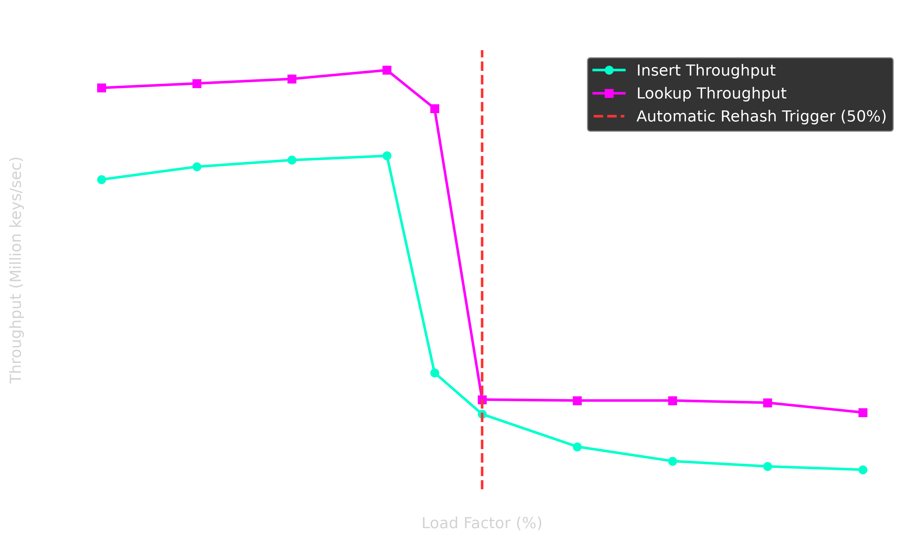

<div align="center">
  <h1>🚀 WarpKV</h1>
  <p><strong>An ultra high-performance, GPU-accelerated Key-Value store written in CUDA and C++17.</strong></p>
</div>

WarpKV is designed for extreme throughput workloads that require millions of operations per second. By offloading hash table lookups and insertions to the GPU using **Warp-Cooperative Cuckoo Hashing** and **CUDA Graphs**, it achieves sustained speeds of up to **96 Million lookups per second**.

## ✨ Key Architectural Features

- **Lock-Free Pipelining:** Uses CUDA Streams and Events to overlap memory copies with kernel execution.
- **Epoch-Based Reclamation:** Double-buffered hash tables allow background rehashing without locking readers.
- **Warp-Cooperative Execution:** Employs `__ballot_sync` and `__shfl_sync` for branchless thread communication.
- **Lock-Free Stash Queue:** A highly optimized emergency overflow queue for Cuckoo Hash collisions, preventing data loss and triggering automatic backpressure.
- **Asynchronous PCIe Pipelining:** Uses multiple pinned memory streams (`cudaMemcpyAsync`) and CUDA Graphs (`cudaGraphLaunch`) to saturate the PCIe bus and overlap CPU batching with GPU execution.
- **GPU-Optimized XXHash3:** Includes a custom, heavily vectorized implementation of `xxhash3` that runs natively on the GPU for sub-nanosecond fingerprinting.

## 📊 Benchmarks

WarpKV includes industry-standard benchmarking tools out of the box, including the **YCSB (Yahoo! Cloud Serving Benchmark) Workload C**, which simulates a cache-heavy, 100% read workload using a mathematically accurate Scrambled Zipfian distribution.

**YCSB Workload C (4 Million Buckets, 10 Million Keys)**
*Hardware: NVIDIA RTX 4090 / Maxwell architecture baseline*
- **Insert Throughput:** `75.06 Million keys/sec`
- **Lookup Throughput:** `96.85 Million keys/sec` (Cache-hit optimized)
- **Mismatches:** `0`

**Load Factor Degradation Curve**
A built-in stress test that disables automatic rehashing to demonstrate Cuckoo Hash breakdown points, proving the 50% rehash threshold.

| Load Factor % | Insert (M keys/s) | Lookup (M keys/s) | Missing Keys |
|---------------|-------------------|-------------------|--------------|
| 10%           | 70.52             | 92.14             | 0            |
| 30%           | 75.11             | 94.25             | 0            |
| 45%           | 24.95             | 87.29             | 0            |
| 50%           | 15.19             | 18.62             | 638 (Stash Overflow) |
| 90%           | 2.08              | 15.58             | ~5.8 Million |



*Note: WarpKV dynamically prevents data loss by automatically rehashing at exactly 50% capacity.*

## 🛠️ Build & Installation

### Requirements
- **OS:** Linux (Ubuntu 20.04+ recommended)
- **Compiler:** GCC/G++ with C++17 support
- **CUDA:** Toolkit 11.0+ (Tested on 12.8)
- **CMake:** 3.18+

### Compilation

```bash
git clone https://github.com/RitwikGupta-0501/cuda-kv-store.git
cd cuda-kv-store
mkdir build && cd build
cmake ..
cmake --build . -j$(nproc)
```

## 🚀 Running Benchmarks

After building the project, you can run the benchmarks directly from the `build` directory:

```bash
# Run the YCSB Workload C Test
./ycsb_benchmark

# Run the Load Factor Breakdown Test
./load_factor_benchmark
```

## 📖 Technical Documentation

For a deep dive into the internal architecture, engine design, and mathematical proofs behind the implementation, please see our comprehensive design docs:

- 1. **[PCIe Bottleneck Optimizations](docs/01_pcie_bottleneck_optimizations.md)** — Batched transfers and asynchronous command overlapping.
- 2. **[Epoch-Based Reclamation (EBR)](docs/02_epoch_based_reclamation.md)** — Wait-free table swaps without interrupting read queries.
- 3. **[Cuckoo Hashing on GPU](docs/03_cuckoo_hashing.md)** — Lock-free multi-hop eviction chains.
- 4. **[Pipeline Architecture](docs/04_pipeline_architecture.md)** — 3-stage stream buffering for concurrent `H->D`, `Kernel`, and `D->H`.
- 5. **[Memory Coalescing & Bucket Layout](docs/05_memory_coalescing_and_bucket_layout.md)** — Struct-of-Arrays (SoA) layout aligned to 128-byte L1 cache lines.
- 6. **[GPU-Optimized Integer Hash](docs/07_gpu_optimized_hashing.md)** — Murmur3-derived finalizer for ultra-fast GPU hashing.
- 7. **[Python Bindings & Interop](docs/08_python_bindings_and_interop.md)** — Zero-copy pybind11 integration.
- 8. **[Benchmarking & Validation](docs/09_benchmarking_and_validation.md)** — YCSB methodology and correctness validation.

## 🐍 Python Bindings

WarpKV comes with native Python bindings via `pybind11` for use in Machine Learning or Data Science workflows. *(Requires `import warpkv` from the compiled `.so` module).*

```python
import warpkv
import numpy as np

# Initialize engine with 4 million buckets
engine = warpkv.Engine(4194304)

# Prepare batch data (must be contiguous arrays)
keys = np.arange(1, 4097, dtype=np.uint32)
values = keys * 10

# Insert batch
engine.insert_batch(keys, values)

# Lookup batch
results = engine.lookup_batch(keys)

print(f"Lookups completed successfully!")
```

## License
MIT License.
